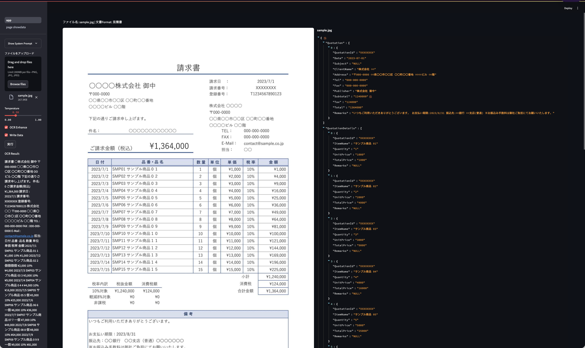
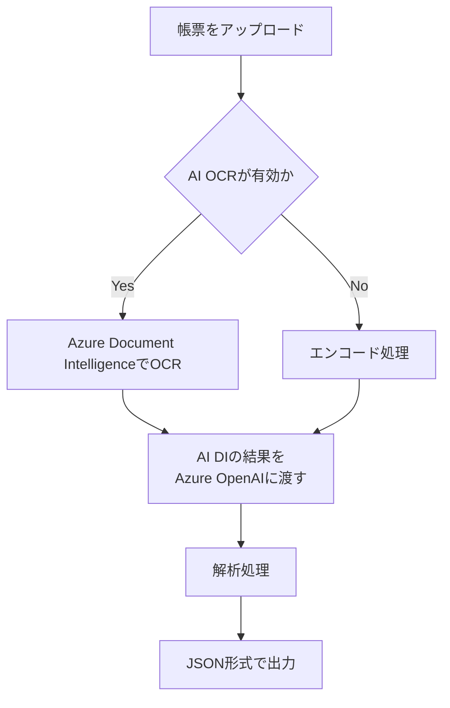

# software-scanner-poc
Azure AI Document Intelligence と Azure OpenAI を活用した、ソフトウェアスキャナー

ファイルを

## 概要
* ファイルをアップロードすると、所定の JSON フォーマットに従い、画像をオブジェクトに変換する
* サイドバー：OCRの生データ表示


* 処理



### setup
```bash
$ touch .env # setting your api key and other
$ python -m venv venv
$ source venv/bin/activate
$ pip install -r requirements.txt
```

### run
streamlitを起動する
```bash
$ cd app
$ streamlit run app.py
```

### sample data
* テスト用データ
* `sample/` に配置されている
[参考資料](https://plus-pm.jp/wp-content/uploads/blog/invoice-legal-compliance-excel-portrait-blue/invoice-legal-compliance-excel-portrait-blue-01.png)

### 注意
* Azure AI Document Intelligence と Azure OpenAI のAPIキーが必要